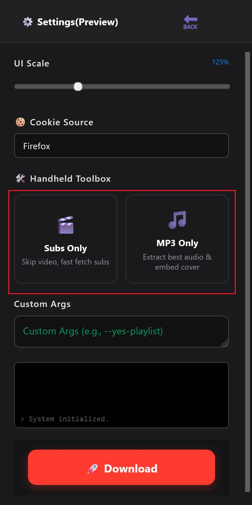

# YT-Smart-Assistant 🤖
**Current Version:** V1.0 
(This is a massive milestone update and will revise readme later)

[中文] 一个基于 Deno 全栈架构的流媒体智能归档与处理助手。


## 📖 Introduction (简介)

**YT-Smart-Assistant** is a full-stack media management tool designed to bridge the gap between browser interactions and local CLI power.

Unlike simple downloaders, it acts as an intelligent **"Media Archiver"**. It runs a local Deno server to handle complex tasks that browsers cannot perform: analyzing 4K streams, fixing subtitle timestamps, batch cleaning junk files, and strictly muxing tracks into clean MP4 containers.

**YT-Smart-Assistant (YT 智能助手)** 是一个为了突破浏览器限制而生的全栈工具。它不仅仅是一个下载器，更是一个部署在本地的**“媒体归档管家”**。通过油猴脚本与本地 Deno 后端的配合，它能实现 4K 视频流分析、字幕时间轴自动修复、垃圾文件自动清理以及无损封装等复杂功能。

<p align="center">
  
</p>

<p align="center">
  
</p>

<p align="center">
  
</p>

<p align="center">
  
</p>

------------------

## ✨ Key Features (核心功能)

### 🎥 Core Downloading (核心下载)
* **🔍 Smart Analysis & Filtering (智能侦察与过滤)**
    * **No More Noise:** Automatically filters out unusable low-resolution garbage (144p/240p) and low-bitrate streams.
    * **Best First:** Intelligently sorts and presents the **highest quality options** (4K/8K + AV1/VP9) at the very top for instant selection.
    * *自动净化列表，直接过滤掉 144P/240P 等无用的低质冗余选项。智能重排，将 **最高画质**（4K/8K + AV1/VP9）直接置顶，拒绝在几十个垃圾选项中翻找。*

* **✂️ Precise Clip & Sub Slicing (精准截取与字幕裁切)**
    * Supports time-range downloading with frame-perfect accuracy. **Unique Feature:** Automatically slices and repairs subtitles to match the specific clip duration, giving you perfectly synced subtitles for just that segment (no more full-length `.srt` mess).
    * *支持毫秒级的时间片段截取，只下载你需要的 5 分钟。**独家特色：** 智能裁切并修复对应时间段的字幕，自动对齐时间轴，拒绝下载全场直播的“万字长文”字幕。*

### 🧠 Intelligent Subtitle Pipeline (智能字幕流水线) `NEW`

* **Auto-Fix & De-Duplicate (自动修复与去重)**
    * Algorithms to fix timestamp overlaps and merge fragmented subtitles.
    * *内置算法自动修复字幕时间轴重叠，合并碎裂的语句，确保字幕流畅。*

* **Hot-Search Logic (热感应锁定)**
    * **Smart Detection:** Uses a modification-time-based heuristic to locate the correct video file, bypassing errors caused by filename mangling (e.g., `?` becoming `_`) or character encoding issues.
    * *基于“文件修改时间”的热感应搜索逻辑，无视特殊字符（如问号变下划线）导致的文件名不匹配问题，精准锁定刚下载的视频。*

* **Clean Muxing (纯净封装)**
    * Automatically filters out junk tracks (`und`, `orig`), keeps only **English** and **Chinese**, and tags them correctly in the MP4 metadata.
    * *拒绝杂乱！自动剔除原始垃圾轨道，只保留中英文字幕并正确标记语言元数据。*

* **Auto-Cleanup (无痕清理)**
    * **Zero Trace:** Deletes `.srt`, `.orig`, and `.tmp` files instantly after muxing. Your download folder stays clean with just the final MP4.
    * *封装完成后自动执行“过河拆桥”式清理，秒删所有中间字幕文件与临时文件，确保文件夹只有最终成品，拒绝垃圾堆积。*

### 🎨 Advanced Settings (高级参数设置)
* **🖥️ Adaptive UI Scaling (界面缩放适配)**
    * Built-in dynamic scaling slider allows you to adjust the interface size freely. Whether you are using a compact laptop or a huge 4K monitor, or simply prefer larger text for better readability, you can find your perfect view.
    * *内置动态缩放调节功能。无论你是使用 4K 高分屏，还是为了呵护视力需要更大的字体，都可以自由调节界面比例，找到最舒适的视觉体验。*

* **⚡ Native Command Injection (原生命令注入)**
    * **Power User Friendly:** Dedicated input box for raw `yt-dlp` arguments (e.g., `--proxy`, `--limit-rate`).
    * **Top Priority Execution:** Custom arguments are injected with the **highest priority** in the execution chain, ensuring your custom commands override default behaviors effectively.
    * *极客模式：提供 `yt-dlp` 原生参数输入框。**最高优先级执行：** 你输入的自定义参数将在执行链中排在首位，拥有最高权重，可轻松覆盖默认逻辑或实现特殊下载需求。*
------------------

## 🛠️ Tech Stack (技术栈)

* **Backend**: [Deno] (TypeScript) - Secure & Modern Runtime.
* **Frontend**: Tampermonkey / GreaseMonkey Script.
* **Core Engine**: `yt-dlp` & `ffmpeg`.

------------------

## 🚀 Installation (安装指南)

### Option A: The "Lazy" Way (Recommended) / 懒人整合包（推荐）

1.  Go to the **[Releases](../../releases)** page on the right.
    * *点击右侧的 **Releases** 页面。*
2.  Download the latest `.zip` file (e.g., `YT-Smart-Assistant_v0.9.6_Full.zip`).
    * *下载最新的整合压缩包。*
3.  Unzip it to a folder. You will see `Start.bat` and a `server` folder containing all necessary tools (`deno`, `ffmpeg`, `yt-dlp`).
    * *解压到任意文件夹。你会看到 `Start.bat` 和包含所有工具的 `server` 目录。*

### Option B: Manual Setup (For Devs) / 手动安装（开发者）

If you prefer building from source:
1.  Download **yt-dlp.exe**, **ffmpeg.exe**, and **deno.exe**.
2.  Place them inside the `server/` directory.
3.  Ensure your file structure looks like this:

```text
Root/
├── Start.bat
├── client/
│   └── script.user.js
└── server/
    ├── server.ts
    ├── deno.exe
    ├── ffmpeg.exe
    └── yt-dlp.exe

------------------
🎮 Usage (使用方法)

### Step 1: Start Backend (启动后端)

  1.  Double-click **`Start.bat`**.
    * *双击运行根目录下的 `Start.bat`。*
  2.  **🛡️ Security Alert (重要):**
    * If Windows Firewall pops up about Deno, you need to click **"Allow access"** (Recommended to check both Private & Public networks).
    * *如果 Windows 防火墙弹出安全警报，请点击 **“允许访问”**（建议同时勾选专用网络和公用网络）。*
  3.  **Success Indicator (启动成功):**
    * A terminal window will open showing: `🚀 Service started at: http://localhost:6969`
    * **Keep this window open.**
    * *当黑框显示上述启动信息时即代表成功。**请保持此黑色终端窗口开启**（不要关闭）。*


### Step 2: Install Frontend Script (安装前端脚本)

  1.  **Prepare the Extension (准备扩展):**
    * Go to your browser's extension management page, find Tampermonkey, click "Details", and enable **"Allow user scripts"**.
    * *(进入浏览器的扩展程序管理页面 -> 找到篡改猴 -> 详细信息，开启 **“允许用户脚本”** 选项。)*

  2.  **Drag & Drop Installation (拖拽安装):**
    * Open the Tampermonkey **Dashboard** (Management Panel).
    * Drag and drop the **`client/script.user.js`** file directly into the dashboard window. It will prompt to install.
    * *(打开篡改猴的 **“管理面板”**，直接将 `client/script.user.js` 文件拖进面板窗口，点击安装即可。)*

------------------
### 🍪 Important: Best Performance with Firefox (重要：关于画质解锁)

**Why Firefox? (为什么推荐火狐?)**
Downloading HD videos without cookies often leads to **errors** or throttling. Currently, the core engine (`yt-dlp`) has the highest success rate when extracting these necessary cookies from **Firefox** compared to other browsers.
*(不加载 Cookie 下载高清视频极易导致**报错**或被限速。目前核心组件对 **Firefox (火狐浏览器)** 的 Cookie 读取机制最成熟、最稳定，是解决下载报错的最佳方案。)*

> **⚠️ 360P Limit Warning (低画质警告):**
> If you have not logged into YouTube on your local Firefox browser, you will see the following message:
"⚠️ Not Logged In: Only 360P available. Login via Firefox to unlock HD."
> **注意：** 如果你尚未在本地的 **Firefox (火狐浏览器)** 上登录 YouTube 账号，将会看到以下提示（此时画质将被限制）：
> *`"⚠️ 未登录状态: 仅能获取 360P。请在火狐登录以解锁高清。"`*

> **Solution (解决方法):**
> Please install Firefox on your PC, **log in to your YouTube account once**, and the tool will automatically sync the cookies to unlock 4K/8K qualities.
> *(如果你未在电脑端的火狐浏览器上登录油管账号，工具将无法获取高清权限。请务必安装火狐并登录一次 YouTube 账号即可自动解锁。)*

------------------
### Step 3: Enjoy (开始下载)
Open any YouTube video. You will see a floating control panel in your browser.
Click "🚀 Download Now".


------------------
## ⚙️ Configuration (配置与网络)

* **Port (端口)**: Default is `6969`.
    * *默认运行端口为 `6969`。*

* **Language (语言)**: Click the title "YT..." on the top-left of the panel to switch between English/Chinese.
    * *点击面板左上角的 "YT..." 标题，即可在 中文/英文 界面之间切换。*

------------------
### 🌐 Proxy & VPN Settings (代理与科学上网注意事项)

If you use proxy tools like **Clash**, **V2Ray**, or **v2rayN** to access YouTube, please note:
*(如果您使用 Clash、V2Ray 等代理工具访问 YouTube，请注意以下几点：)*
  1.  **Enable "System Proxy" (开启系统代理)**:
    * The backend downloader (`yt-dlp`) relies on Windows system proxy settings. Please ensure **"System Proxy"** is enabled in your Clash/V2Ray client.
    * *后端下载引擎依赖 Windows 系统代理设置。请务必在代理软件中开启 **“系统代理”** 模式，否则后端可能无法连接网络。*
  2.  **Try "TUN Mode" (尝试 TUN 模式)**:
    * If downloads fail to start, try enabling **TUN Mode**. This forces all traffic (including CLI tools) through the proxy, which is often more stable.
    * *如果下载无法开始或报错，请尝试开启 **TUN 模式**。这能强制接管所有流量（包括命令行工具），通常比系统代理更稳定。*
  3.  **Rule vs Global (规则与全局)**:
    * If downloads are slow, temporarily switch to **"Global Mode"** to ensure the traffic is actually going through your high-speed nodes.
    * *如果下载速度异常缓慢，请尝试暂时切换到 **“全局模式”**，以排除因分流规则错误导致流量直连而变慢的问题。*


⚠️ Disclaimer (免责声明)
This project is for educational and technical research purposes only (demonstrating Deno runtime, FFmpeg stream mapping, and local server interactions).

Please respect copyright laws and platform Terms of Service.
Do not use this tool to distribute copyrighted content.
The author assumes no responsibility for how this tool is used.


本项目仅用于技术研究与教育目的（展示 Deno 运行时、FFmpeg 流映射与本地全栈交互技术）。请遵守相关法律法规及平台服务条款，切勿用于侵犯版权的行为。

