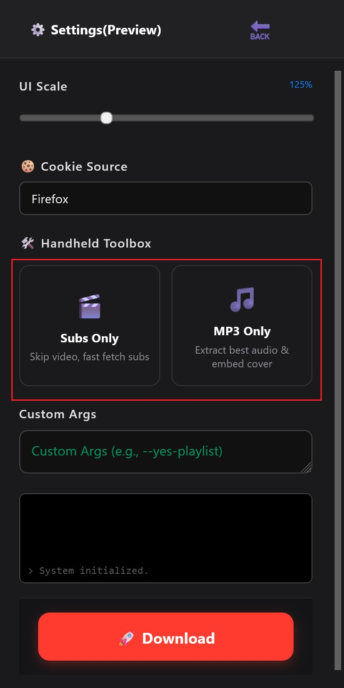

# 🚀 YT-Smart-Assistant

**Current Version:** `V1.0.3`  
*(This is a massive milestone update)*

https://github.com/user-attachments/assets/3e530969-429c-429b-94b0-dd165222e63d

---

## 📖 Introduction (简介)

**YT-Smart-Assistant** is a high-performance, privacy-focused media management tool. Unlike simple downloaders, it acts as an intelligent **"Media Archiver"**, bridging the gap between browser interactions and high-end processing.
**YT-Smart-Assistant (YT智能助手)** 是一个基于 Deno 全栈架构的流媒体智能归档助手。它不仅仅是一个下载器，更是一个部署在本地的**“媒体归档管家”**，通过油猴脚本与本地后端的配合，实现 4K 视频分析、字幕自动修复与无损封装。

<p align="center">
  
  
  
  
</p>

---

## 🛡️ Security & Privacy (Zero Trust Architecture)

> [!IMPORTANT]
> **We build for safety.** This project follows a "Paranoid-First" approach to ensure your data stays yours.

* **🔒 100% Localhost:** The entire stack runs strictly on `127.0.0.1`. **Zero data** is sent to third-party servers.
* **🛡️ XSS Immune:** Strictly **no `innerHTML`** usage. All UI rendering uses secure text-node methods to prevent malicious metadata injection.
* **🚫 No Auto-Updates:** There are **no background update checks** or "phoning home" scripts. You are in total control of your version.
* **📦 Bring Your Own Binaries:** You manage your core dependencies (`yt-dlp`, `ffmpeg`). Update them manually via official sources whenever you want.
* **⚖️ The Bottom Line:** If there is a "security" alert, it is a vulnerability within your browser or local OS, not this tool.

---

## ✨ Key Features

### 🎥 Core Downloading
* **🔍 Smart Analysis:** Automatically filters out low-res garbage (144p/240p). **Highest quality** (4K/8K + AV1) is always prioritized at the top.
* **✂️ Precise Slicing:** Supports frame-perfect time-range downloads.
* **🎯 Subtitle Slicing (Unique):** Automatically repairs and slices subtitle tracks to match your specific video clip. No more out-of-sync captions.

### 🧠 Intelligent Subtitle Pipeline `NEW`
* **🔄 Auto-Fix:** Built-in algorithms fix timestamp overlaps and merge fragmented lines.
* **🔥 Hot-Search Logic:** Uses modification-time heuristics to locate files, ignoring OS filename character mangling (e.g., `?` becoming `_`).
* **📦 Clean Muxing:** Strips junk tracks (`und`, `orig`), keeping only high-quality English and Chinese tracks with correct metadata.
* **🧹 Zero-Trace:** Instantly deletes `.srt`, `.orig`, and `.tmp` files after muxing.

### 🎨 Advanced UX
* **🖥️ UI Scaling:** A dynamic slider to resize the interface for any screen size (from 13" laptops to 4K monitors).
* **⚡ Command Injection:** Dedicated input for raw `yt-dlp` arguments. Injected with **highest priority** to override default behaviors.

---

## 🛠️ Tech Stack

* **Backend:** [Deno] (TypeScript) - Secure & modern runtime.
* **Frontend:** Tampermonkey / GreaseMonkey (JavaScript).
* **Core Engine:** `yt-dlp` & `ffmpeg`.

---

## 🚀 Installation

### Step 1: Backend Setup
1. Go to the **[Releases](../../releases)** page.
2. Download the latest `YT-Assistant-Full.zip`.
3. Unzip to any folder.

### Step 2: Browser Setup
1. Install the **Tampermonkey** extension for your browser (Chrome, Edge, or Firefox).
2. Ensure **"Allow access to file URLs"** is enabled in Tampermonkey settings (if loading locally).

---

## 📁 File Structure
Maintain the following files in the same directory:

```text
Root/
├── YT-Smart-Assistant.bat  <-- Run this!
├── script.user.js          <-- Install this in Tampermonkey
├── server.bundle.js
├── deno.exe
├── ffmpeg.exe
├── ffprobe.exe
└── yt-dlp.exe

🎮 Usage   
Launch Backend: Double-click YT-Smart-Assistant.bat.

Keep the terminal open: 🚀 Service started at: http://localhost:6969.

Install Frontend: Drag and drop script.user.js into your Tampermonkey Dashboard and click Install.

Download: Open any YouTube video. Adjust settings on the floating panel and click "🚀 Download Now".

⚙️ Configuration & Troubleshooting
🍪 The Cookie Issue (Unlocking 4K/8K)
[!TIP]
Don't forget to load cookies! By default, the engine uses Firefox cookies. Ensure you are logged into YouTube in Firefox.

Using Chrome/Edge? Open Advanced Settings (⚙️) in the UI and change the browser source.

Portable Browser? You can specify the profile path directly in the UI settings.

🌐 Proxy & VPN (Clash / V2Ray)
Ensure "System Proxy" is enabled in your VPN client.

If downloads fail, try enabling TUN Mode.

You can manually input --proxy "http://127.0.0.1:PORT" in the UI command box.

⚠️ Disclaimer
This project is for educational and technical research purposes only. Please respect copyright laws and platform Terms of Service. The author assumes no responsibility for any misuse.

本项目仅用于技术研究与教育目的。请遵守相关法律法规及平台服务条款，切勿用于侵犯版权的行为。
